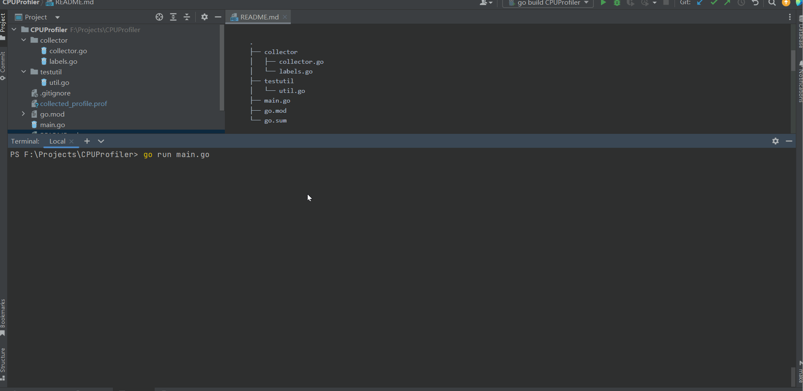

# CPU Profiler 示例

本项目演示了如何使用 Go 的 `pprof` 包来分析具有不同标签的多个 $\text {goroutine}$ 的 $\text {CPU}$ 使用情况。该项目包括两个主要组件：

- 用于捕获和处理 $\text {CPU}$ 分析的 `collector` 包
- 用于模拟带有标签的 $\text {goroutine}$ $\text {CPU}$ 负载的 `testutil` 包

项目结构：

```
.
├── collector
│   ├── collector.go
│   └── labels.go
├── testutil
│   └── util.go
├── main.go
├── go.mod
└── go.sum
```

## 前提

- $\text {Go} \ 1.21.10$ 或更高版本

## 安装

1. 克隆代码库

```shell
$ git clone https://github.com/SolisAmicus/cpu-profiler-example.git

$ cd cpu-profiler-example
```

2. 安装依赖项

```shell
$ go mod tidy
```

## 运行示例

```shell
$ go run main.go
```



## 包

### collector

`collector`  包负责捕获和处理 $\text {CPU}$ 分析。

- `collector.go`：定义了 $\text {CPU}$ 收集器及相关方法。
- `labels.go`：提供了创建带有单个和多个标签的 $\text {context}$ 的函数。

### testutil

`testutil` 包提供了用于模拟带有标签的 $\text {goroutine}$ $\text {CPU}$ 负载的工具。

- `util.go`：包含启动带有 $\text {CPU}$ 密集型任务的 $\text {goroutine}$ 的函数。

```go
// 启动单标签 goroutine
ctx := collector.CtxWithLabel(context.Background(), "rule1")
testutil.MockSingleCPULoad(ctx, "rule1")

// 启动多标签 goroutine
labels := []string{"rule1", "rule2", "rule3"}
ctx := collector.CtxWithLabels(context.Background(), labels)
testutil.MockMultiCPULoad(ctx, labels...)
```

## 示例

`example/main.go` 文件演示了如何使用 `collector` 和 `testutil` 包来分析具有不同标签的多个 $\text {goroutine}$ 的 $\text {CPU}$ 的使用情况。

